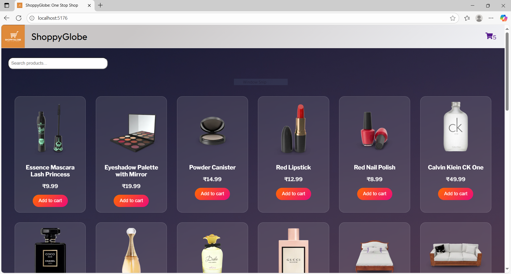
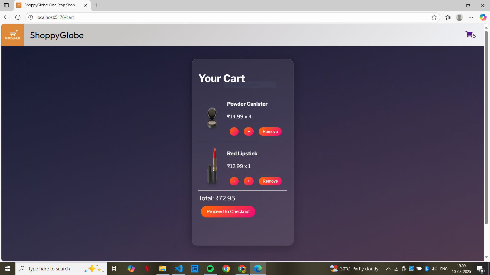

# 🛒 ShoppyGlobe - One Stop Shop; E-commerce Application

ShoppyGlobe is an e-commerce web application built with **React** with product listings, detailed product pages, a shopping cart, and a smooth checkout flow.  

## Features

- **Product Listings** – Browse products in a responsive grid.
- **Product Details** – View detailed descriptions and add items to cart.
- **Shopping Cart** – Add/remove items, adjust quantities, and see totals in real-time.
- **Checkout Page** – Smooth checkout process.
- **Responsive Design** – Optimized for mobile, tablet, and desktop.
- **Cart Badge** – Real-time item count displayed in header.

## Previews

Home Screen



Cart Page



## 🛠️ Tech Stack

- **Frontend:** React, React Router, Redux
- **Styling:** CSS3, Flexbox, CSS Grid, Media Queries
- **Icons:** react-icons
- **Build Tool:** Vite

---

##  Installation & Setup

1. **Clone the repository**
```bash
git clone https://github.com/hardikjha/shoppyglobe.git
cd shoppyglobe
```

2. **Install dependencies**
```bash
npm install
```

3. **Run the development server**
```bash
npm run dev
```
Then open: **http://localhost:5177**

---

[Repository Link](https://github.com/hardikjha/shoppyglobe)

**Made by Hardik Kumar**
